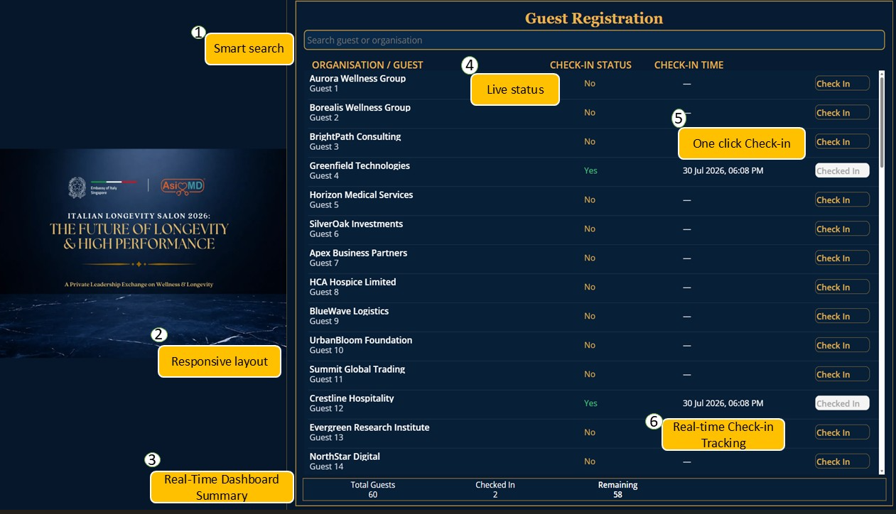

# Guest Registration App

Turning a Real Business Requirement into a Digital Solution.

## 📌 Overview
A guest registration system built for the Italian Embassy event in Singapore.

## 🏢 Business Requirement
The event required fast, accurate, and professional guest registration.

## 💡 My Solution
A responsive Power Apps Canvas App with SharePoint backend.

### Features
- ✅ Instant guest & organisation search  
- ✅ One‑click check‑in  
- ✅ Automatic check‑in time recording  
- ✅ Live attendance status  
- ✅ Real‑time attendance summary  
- ✅ Responsive, user‑friendly interface  

## 🛠️ Technologies & Skills
- Microsoft Power Apps  
- Microsoft SharePoint  
- Microsoft Power Platform  
- UI/UX Design  
- Business Process Digitalisation  

## 🎥 Demo
[▶ Watch Demo Video](https://youtu.be/CLvYJTzseXA)

## 📈 Impact
Streamlined guest management, eliminated manual tracking, and delivered a seamless experience.

